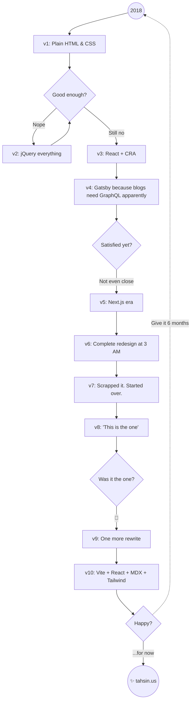

# tahsin.us

Personal portfolio, blog, and photography site built with React, TypeScript, Tailwind CSS, and MDX.

> _Code, coffee, cameras — not always in that order._

## Overview

This is the source code for my personal website. It features:

- **Blog** — Long-form articles on CSS, JavaScript, SVG, animation, and career topics, written in MDX with syntax highlighting via Shiki
- **Photography** — Trip galleries with automatic EXIF metadata extraction
- **Portfolio** — Work experience timeline, skills, and open-source contributions
- **About** — Interactive bento-grid layout with illustrations
- **Dark / light theme** — Persistent theme toggle

## Tech Stack

| Layer      | Technology                            |
| ---------- | ------------------------------------- |
| Framework  | React 19, React Router 7              |
| Language   | TypeScript (strict mode)              |
| Styling    | Tailwind CSS v4 (`@tailwindcss/vite`) |
| Content    | MDX with remark/rehype plugins        |
| Syntax     | Shiki + rehype-pretty-code            |
| Diagrams   | Mermaid                               |
| Build      | Vite 8                                |
| Icons      | Lucide React                          |
| Runtime    | Bun                                   |
| Deployment | Kubernetes (Hono static server)       |

## How This Site Gets Made

## License

All rights reserved.
