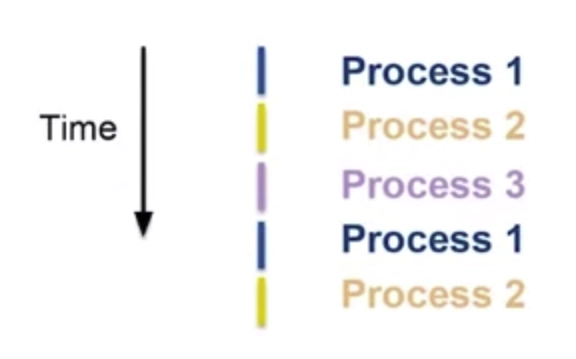
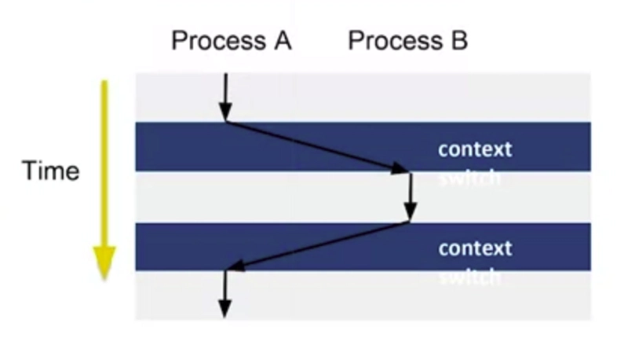
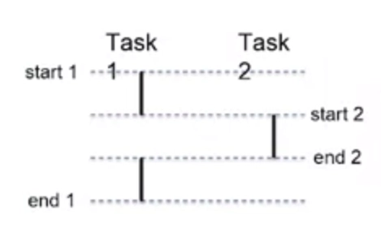
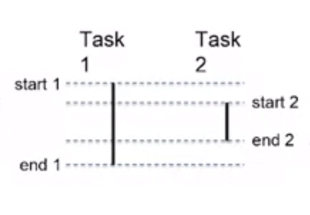

import Mermaid from "@/components/Mermaid";

They sound the same. They're used interchangeably in conversations. But concurrency and parallelism are fundamentally different concepts — and confusing them leads to bad architectural decisions.

Let's build up from first principles.

---

## First: How Does a CPU Actually Work?

A single processor core can execute **one instruction at a time**. That's it. One.

Yet on a single-core machine, you can play music, browse the web, and receive email notifications — all seemingly at the same time. How?

**Context switching.**

The operating system rapidly cycles between processes using a scheduling algorithm (like round-robin). Each process gets a tiny slice of CPU time before the OS freezes it and hands the CPU to the next one.

The switch happens so fast — thousands of times per second — that it creates the **illusion** of simultaneous execution. But at any given nanosecond, only one process is running.

When the OS switches from Process A to Process B, it saves Process A's entire state (registers, memory, program counter) and loads Process B's state. When it switches back, Process A resumes exactly where it left off. This is the foundation of multitasking on a single core.

---

## Concurrency

With that context, concurrency becomes clear.

> **Concurrency** is executing multiple tasks in overlapping time periods — but not necessarily at the same instant.

On a single-core CPU with two tasks, only one runs at any given moment. The OS scheduler interleaves them — starting Task 2 before Task 1 finishes, but freezing Task 1 while Task 2 runs.

The key observation: **Task 1 is paused while Task 2 runs.** They take turns. The context switcher saves Task 1's entire state (code position, memory, registers) so it can resume later as if nothing happened.

This is what your Node.js event loop does. This is what Go goroutines do on a single thread. This is what Python's `asyncio` does. They're all concurrent — managing multiple tasks by interleaving execution — but not parallel.

---

## Parallelism

Parallelism requires **different hardware** — multiple CPU cores, multiple machines, or both.

> **Parallelism** is executing multiple tasks at literally the same instant, on separate processing units.

Notice the difference: Task 1 **doesn't stop** when Task 2 starts. Both are physically running at the same moment on separate cores. There's no illusion here — it's real simultaneous execution.

---

## The Key Difference

<Mermaid
  chart={`flowchart LR
    subgraph con ["Concurrency"]
        direction TB
        C1["Multiple tasks in progress"]
        C2["One runs at a time"]
        C3["Interleaved via context switching"]
        C4["Single core is enough"]
    end
    subgraph par ["Parallelism"]
        direction TB
        P1["Multiple tasks in progress"]
        P2["Multiple run simultaneously"]
        P3["True simultaneous execution"]
        P4["Requires multiple cores"]
    end

    style con fill:none,stroke:#3b82f6,color:#e2e8f0
    style par fill:none,stroke:#22c55e,color:#e2e8f0
    style C1 fill:#3b82f6,color:#fff
    style C2 fill:#3b82f6,color:#fff
    style C3 fill:#3b82f6,color:#fff
    style C4 fill:#3b82f6,color:#fff
    style P1 fill:#22c55e,color:#fff
    style P2 fill:#22c55e,color:#fff
    style P3 fill:#22c55e,color:#fff
    style P4 fill:#22c55e,color:#fff
  `}
  caption="Concurrency is about structure. Parallelism is about execution."
/>

Or as Rob Pike (co-creator of Go) put it:

> **Concurrency is about *dealing* with lots of things at once. Parallelism is about *doing* lots of things at once.**

Concurrency is a design pattern — how you *structure* your program to handle multiple tasks. Parallelism is an execution strategy — how your hardware *runs* them.

A concurrent program may or may not run in parallel. A parallel program is always concurrent. But they're solving different problems.

---

## Real-World Examples

| Scenario | Concurrent? | Parallel? |
|----------|:-----------:|:---------:|
| Node.js handling 1000 HTTP requests on one thread | Yes | No |
| Python `asyncio` awaiting multiple API calls | Yes | No |
| Java `ForkJoinPool` splitting work across 8 cores | Yes | Yes |
| Go goroutines on a multi-core machine | Yes | Yes |
| A single `for` loop processing items one by one | No | No |
| GPU rendering millions of pixels simultaneously | Yes | Yes |

---

## Why Does This Matter?

Understanding the distinction changes how you architect systems:

- **I/O-bound work** (API calls, database queries, file reads) benefits most from **concurrency**. The CPU is idle while waiting for responses — context switching to another task costs almost nothing.

- **CPU-bound work** (image processing, encryption, data crunching) benefits from **parallelism**. The CPU is actively computing — you need more cores, not more context switches.

Throwing threads at an I/O-bound problem wastes resources. Trying to parallelize a single-threaded runtime (like Node.js) for I/O work misses the point — it's already concurrent.

---

## A Mental Model

Think of a **restaurant kitchen**.

**Concurrency:** One chef working on multiple orders. They chop vegetables for order 1, put it in the oven, then start plating order 2 while order 1 bakes. One chef, multiple orders in progress — but only one thing being actively done at a time.

**Parallelism:** Multiple chefs, each working on a different order simultaneously. Order 1 and order 2 are physically being prepared at the same instant.

A well-run kitchen uses both: multiple chefs (parallelism), each handling multiple orders (concurrency).

---

## Summary

| | Concurrency | Parallelism |
|---|---|---|
| **What** | Multiple tasks in overlapping time | Multiple tasks at the same instant |
| **How** | Context switching, interleaving | Multiple cores/machines |
| **Hardware** | Single core is sufficient | Requires multiple cores |
| **Analogy** | One chef, many orders | Many chefs, many orders |
| **Best for** | I/O-bound work | CPU-bound work |

They're complementary, not competing. The best systems use concurrency to structure the work and parallelism to execute it. Understanding when to reach for which is what separates good systems from fast ones.
