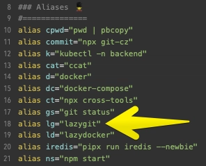

import coverImg from "./cover.jpg";

<figure className="my-10">
  
  <figcaption className="text-center text-muted-foreground text-sm mt-3 italic">My actual setup — where lazygit gets the most mileage.</figcaption>
</figure>

You use Git every hour. Staging files, checking diffs, writing commit messages, switching branches, resolving conflicts, opening PRs — the same sequence, dozens of times a day. Most of it is muscle memory, but it's still slow.

**Lazygit** is a terminal UI for Git that turns all of that into a visual, keyboard-driven experience. No mouse. No browser. No context switching.

---

## The Problem

Here's what a typical Git workflow looks like in the terminal:

```bash
git status
git diff src/auth.ts
git add src/auth.ts
git diff --cached
git commit -m "fix auth token refresh"
git log --oneline -5
git push
```

Seven commands for one commit. Now multiply that by every feature, bug fix, and refactor in your day. It adds up.

And that's the simple case. Want to stage individual hunks? Interactive rebase? Cherry-pick across branches? The commands get verbose fast.

---

## Enter Lazygit

Lazygit replaces all of that with a single interface:

```bash
# Install (macOS)
brew install lazygit

# Install (Ubuntu/Debian)
sudo apt install lazygit

# Or via Go
go install github.com/jesseduffield/lazygit@latest
```

Launch it with `lazygit` (or set up an alias — I use `lg`):

```bash
# Add to your .bashrc / .zshrc
alias lg="lazygit"
```



---

## What Makes It Great

### Instant Staging & Diffs

The left panel shows your changed files. The right panel shows the diff. Navigate with `j`/`k`, stage with `space`, and you see the diff update in real time. No more `git add`, `git diff`, `git diff --cached` dance.

| Key     | Action               |
| ------- | -------------------- |
| `space` | Stage / unstage file |
| `a`     | Stage all            |
| `enter` | View file diff       |
| `tab`   | Switch panels        |

Want to stage specific lines instead of the whole file? Press `enter` on a file, then stage individual hunks or even individual lines. This alone replaces `git add -p` — but with a visual interface.

### One-Keypress PR Creation

This is my favorite feature. Press `o` on a branch, and Lazygit opens a pull request in your browser — for GitHub, GitLab, or Bitbucket. No need for `gh pr create` or navigating to the repo in your browser. Just `o` and it's done.

### Commit Log & Search

The commits panel gives you a scrollable, interactive history. Press `/` to search through commit messages. Press `enter` on any commit to see the full diff. No need to leave the terminal or open a separate tool.

### Interactive Rebase — Visually

This is where Lazygit really shines. Navigate to the commits panel, and you can:

| Key                 | Action                                 |
| ------------------- | -------------------------------------- |
| `e`                 | Edit a commit                          |
| `s`                 | Squash into previous                   |
| `f`                 | Fixup (squash without editing message) |
| `d`                 | Drop a commit                          |
| `r`                 | Reword commit message                  |
| `ctrl+j` / `ctrl+k` | Move commit up/down                    |

All of this happens visually — you see the commit list reorder in real time. Compare that to `git rebase -i` where you're editing a text file and hoping you got it right.

### Branch Management

Switch branches with arrow keys. Create, delete, merge, rebase — all from the branches panel. You can see which branches are ahead/behind remote, and fast-forward with a single keypress.

### Conflict Resolution

When you hit a merge conflict, Lazygit shows both sides in a split view. Pick the left side, the right side, or both — line by line. It's faster than any editor-based conflict resolution I've used.

---

## Quick Reference

| Panel        | Key     | Action                  |
| ------------ | ------- | ----------------------- |
| **Files**    | `space` | Stage/unstage           |
|              | `a`     | Stage all               |
|              | `c`     | Commit                  |
|              | `enter` | View diff / stage hunks |
| **Branches** | `space` | Checkout                |
|              | `n`     | New branch              |
|              | `o`     | Open PR in browser      |
| **Commits**  | `s`     | Squash                  |
|              | `r`     | Reword                  |
|              | `/`     | Search                  |
| **Global**   | `tab`   | Switch panel            |
|              | `?`     | Show all keybindings    |
|              | `q`     | Quit                    |

---

## Why Not Just Use a GUI?

Tools like GitKraken, Fork, and Tower are great — but they pull you out of the terminal. If you're already in a tmux session, SSH'd into a server, or deep in a vim workflow, switching to a GUI app breaks your flow.

Lazygit lives where you work. It starts in milliseconds, runs in any terminal, and works over SSH. And because it's keyboard-driven, it's actually _faster_ than a mouse-based GUI once you learn the keybindings.

---

## Summary

Lazygit doesn't add new Git capabilities — everything it does, you can do with `git` commands. What it does is **remove friction**. Staging, committing, rebasing, conflict resolution, and PR creation all become instant, visual, and keyboard-driven.

If you spend any meaningful time in the terminal, try it for a week. You'll wonder how you worked without it.

```bash
brew install lazygit && lazygit
```
