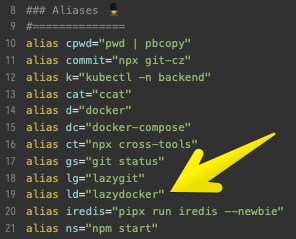

If you've used [Lazygit](/post/get-lazy-with-lazygit), you already know the magic of terminal UIs that replace repetitive CLI commands with a visual, keyboard-driven experience. **Lazydocker** does the same thing — but for Docker.

No web dashboards. No clicking through Portainer. Just open your terminal and see everything.

---

## The Problem

Managing Docker from the CLI means constantly switching between commands:

```bash
docker ps                              # What's running?
docker logs -f my-app                  # What's it saying?
docker stats                           # How much CPU/RAM?
docker compose restart my-app          # Restart it
docker exec -it my-app sh             # Get inside it
docker system prune -f                # Clean up
```

Six commands across six mental contexts. And if you're running multiple services with docker-compose, the juggling gets worse — you're constantly re-typing container names and switching between log streams.

---

## Enter Lazydocker

Lazydocker is an open-source terminal UI for Docker and Docker Compose, written in Go. One interface shows you everything: containers, images, volumes, logs, metrics, and compose services.

```bash
# Install (macOS)
brew install lazydocker

# Install (Linux/other)
curl https://raw.githubusercontent.com/jesseduffield/lazydocker/master/scripts/install_update_linux.sh | bash

# Or via Go
go install github.com/jesseduffield/lazydocker@latest
```

Set up an alias for quick access:

```bash
alias lzd="lazydocker"
```



---

## What You Get

The interface is split into panels — containers on the left, details on the right. Navigate with `j`/`k`, and the right panel updates in real time.

### Logs, Metrics, and Config — All in One View

Select a container and you instantly see:

| Tab | What it shows |
|-----|---------------|
| **Logs** | Live-streaming container logs (like `docker logs -f`) |
| **Stats** | CPU, memory, and network usage as ASCII graphs |
| **Config** | Container configuration, ports, environment variables |
| **Top** | Running processes inside the container (like `docker top`) |

No more switching between `docker logs`, `docker stats`, and `docker inspect`. It's all right there, updating live.

### Container Management

| Key | Action |
|-----|--------|
| `d` | Stop container |
| `s` | Restart container |
| `r` | Remove container |
| `a` | Attach (interactive shell) |
| `m` | View logs |
| `e` | Exec shell into container |
| `b` | View bulk commands |

### Image Management

Navigate to the images panel to see all local images, their sizes, and ancestor layers. Useful for debugging why your image is 2GB when it should be 200MB.

| Key | Action |
|-----|--------|
| `d` | Delete image |
| `p` | Prune unused images |

### Docker Compose Integration

If you're in a directory with a `docker-compose.yml`, Lazydocker automatically groups services and lets you:

- View logs per service
- Restart individual services
- Rebuild from source (`r` then `u` for up with rebuild)
- See which services are healthy, running, or exited

### Cleanup & Pruning

Docker's disk usage grows silently. Lazydocker makes cleanup easy:

- **Prune containers** — remove all stopped containers
- **Prune images** — remove dangling/unused images
- **Prune volumes** — reclaim storage from orphaned volumes

All accessible from the bulk commands menu (`b`).

---

## Quick Reference

| Panel | Key | Action |
|-------|-----|--------|
| **Global** | `tab` | Switch panel |
| | `q` | Quit |
| | `?` | Show all keybindings |
| | `b` | Bulk commands |
| **Containers** | `e` | Exec shell |
| | `s` | Restart |
| | `d` | Stop |
| | `r` | Remove |
| | `m` | Logs |
| **Images** | `d` | Delete |
| | `p` | Prune unused |
| **Volumes** | `d` | Delete |

---

## Lazydocker vs Other Tools

| | Lazydocker | Portainer | Docker CLI |
|---|---|---|---|
| **Interface** | Terminal UI | Web dashboard | Command line |
| **Setup** | Single binary | Docker container | Built-in |
| **Speed** | Instant | Needs browser | Instant |
| **Works over SSH** | Yes | Needs port forwarding | Yes |
| **Docker Compose** | Native support | Limited | Native |
| **Resource usage** | Minimal | Runs as container | None |

If you're already SSH'd into a server, Lazydocker is the fastest way to see what's happening. No ports to expose, no containers to run — just `lzd` and you're in.

---

## Summary

Lazydocker replaces the constant `docker ps` → `docker logs` → `docker stats` → `docker exec` cycle with a single visual interface. Logs stream live, metrics render as graphs, and every action is a keypress away.

If Docker is part of your daily workflow, this saves real time:

```bash
brew install lazydocker && lazydocker
```
