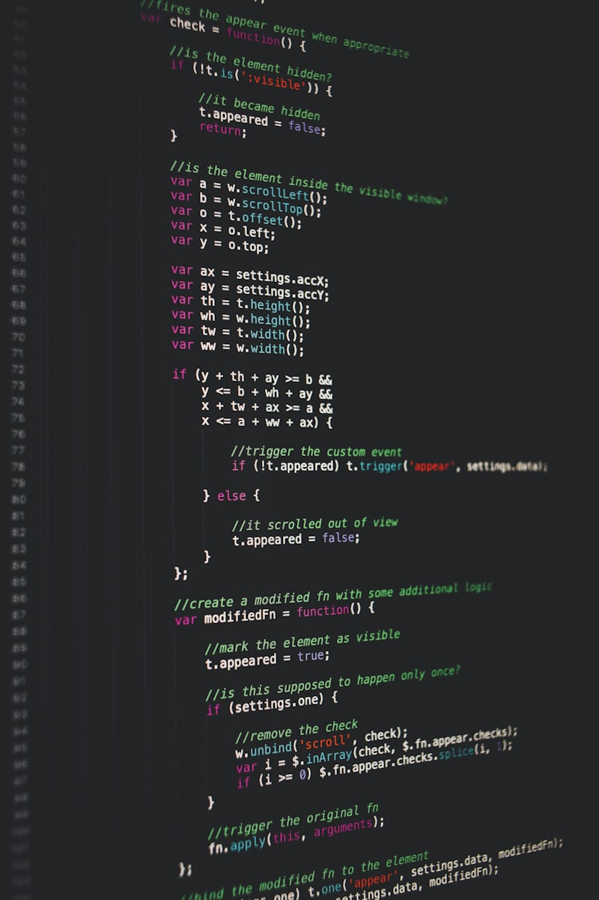

# Springs and Bounces in Native CSS

For years, if you wanted physics-based animations on the web, you needed JavaScript. Libraries like Framer Motion and React Spring made it possible to create natural-feeling bounces and springs, but vanilla CSS was stuck with `ease`, `ease-in-out`, and `cubic-bezier()`.

That all changed with the `linear()` timing function.



---

## What is `linear()`?

The `linear()` function lets you define a custom easing curve as a series of points. Unlike `cubic-bezier()` which is limited to a single cubic curve, `linear()` can approximate **any** curve by sampling it at multiple points.

```css
.bouncy {
  transition: transform 600ms
    linear(
      0,
      0.004,
      0.016,
      0.035,
      0.063,
      0.098,
      0.141,
      0.191,
      0.25,
      0.316,
      0.391,
      0.473,
      0.563,
      0.66,
      0.766,
      0.879,
      1,
      1.089,
      1.148,
      1.178,
      1.18,
      1.157,
      1.112,
      1.048,
      0.968,
      0.878,
      0.781,
      0.683,
      0.587,
      0.497,
      0.417,
      0.349,
      0.296,
      0.259,
      0.239,
      0.237,
      0.251,
      0.281,
      0.325,
      0.381,
      0.447,
      0.521,
      0.601,
      0.684,
      0.768,
      0.85,
      0.928,
      1
    );
}
```

That long list of numbers defines a spring-like curve that overshoots, bounces back, and settles at the final value.

## Why Springs Feel Natural

In the real world, nothing moves with a linear or cubic-bezier easing. When you flick a toggle switch, it doesn't ease smoothly into place — it snaps over, bounces a little, and settles.

Spring physics models this naturally. A spring animation has three key properties:

1. **Stiffness** — how "tight" the spring is (higher = faster)
2. **Damping** — how quickly vibrations die out
3. **Mass** — how heavy the thing being sprung is

Here's a remote image that captures the feeling of fluid, spring-like motion in digital interfaces:


## Generating Spring Curves

The trick is to pre-compute a spring simulation and sample it into `linear()` points. Here's a simple spring function:

```js
function generateSpring({ stiffness = 100, damping = 10, mass = 1, samples = 48 } = {}) {
  const points = [];
  const omega = Math.sqrt(stiffness / mass);
  const zeta = damping / (2 * Math.sqrt(stiffness * mass));

  for (let i = 0; i <= samples; i++) {
    const t = i / samples;
    const time = t * 2; // 2 seconds of simulation
    let value;

    if (zeta < 1) {
      // Underdamped — the springy case
      const wd = omega * Math.sqrt(1 - zeta * zeta);
      value = 1 - Math.exp(-zeta * omega * time) * (Math.cos(wd * time) + ((zeta * omega) / wd) * Math.sin(wd * time));
    } else {
      // Critically or overdamped
      value = 1 - Math.exp(-omega * time) * (1 + omega * time);
    }

    points.push(Math.round(value * 1000) / 1000);
  }

  return `linear(${points.join(", ")})`;
}
```

## Practical Examples

### Bouncy Button

```css
.button {
  transition: transform 500ms
    linear(
      0,
      0.063,
      0.25,
      0.563,
      1,
      1.178,
      1.18,
      1.048,
      0.878,
      0.683,
      0.497,
      0.349,
      0.259,
      0.237,
      0.281,
      0.381,
      0.521,
      0.684,
      0.85,
      0.968,
      1.048,
      1.089,
      1.098,
      1.082,
      1.048,
      1,
      0.951,
      0.916,
      0.9,
      0.905,
      0.928,
      0.962,
      1
    );
}

.button:hover {
  transform: scale(1.1);
}
```

### Slide-in Notification

```css
.notification {
  transform: translateX(100%);
  transition: transform 700ms
    linear(0, 0.098, 0.391, 0.766, 1.148, 1.18, 1.048, 0.878, 0.683, 0.497, 0.349, 0.259, 0.237, 0.281, 0.381, 0.521, 0.684, 0.85, 0.968, 1.048, 1.082, 1.048, 1, 0.962, 0.942, 0.948, 0.969, 0.992, 1);
}

.notification.visible {
  transform: translateX(0);
}
```

## Browser Support & Limitations

The `linear()` timing function is supported in all modern browsers as of 2025. There are some things to keep in mind:

- More sample points = smoother animation, but also bigger CSS
- 48 points is usually enough for a convincing spring
- You can't dynamically change the spring parameters without regenerating the curve
- For truly interactive springs (drag-and-drop, gestures), you still need JS

> **My recommendation:** Use `linear()` for UI microinteractions (buttons, modals, toggles) and save JS spring libraries for complex interactive animations.

## Tools

- [Spring Generator](https://www.joshwcomeau.com/animation/css-spring/) — my tool for generating CSS spring curves
- [Open Props Easings](https://open-props.style/#easing) — a collection of pre-built easing curves
