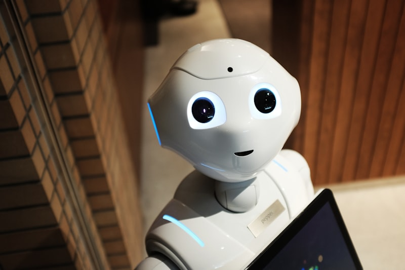
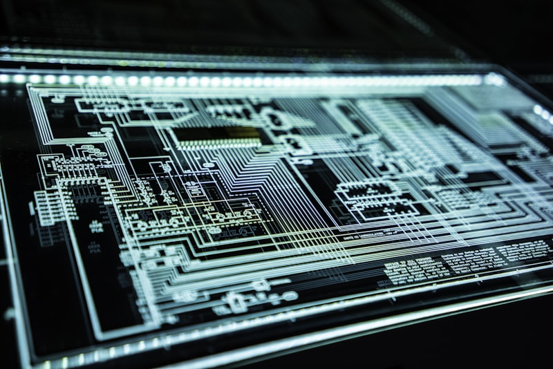

# The Post-Developer Era

When OpenAI released GPT-4 back in March 2023, they kickstarted the AI revolution. The consensus online was that front-end development jobs would be totally eliminated within a year or two.

Well, it's been more than two years since then. Let's revisit those predictions.

---

## The Original Predictions

In early 2023, the tech world was on fire with AI predictions:

- _"Front-end developers will be obsolete within 18 months"_
- _"GPT-5 will be able to build entire applications from a prompt"_
- _"Junior developer positions will vanish by 2025"_

These weren't fringe opinions. They came from respected voices in the industry — VCs, CTOs, even some developers themselves.

## What Actually Happened

The reality, as usual, has been more nuanced. Here's what I've observed:

### AI Has Gotten Much Better

There's no denying that AI coding assistants have improved dramatically. GitHub Copilot, Cursor, and similar tools have become genuinely useful. I personally use them every day.

### But They Haven't Replaced Us

Despite the improvements, AI hasn't replaced developers. Here's why:

1. **Context matters enormously.** AI can write code snippets, but understanding a codebase's architecture, business logic, and constraints requires deep contextual knowledge that AI still struggles with.

2. **The hard part isn't writing code.** The challenge of software development has never been typing speed. It's understanding requirements, making trade-offs, debugging edge cases, and communicating with stakeholders.

3. **Quality requires judgment.** AI can generate code that _works_, but producing code that's maintainable, accessible, performant, and secure requires human judgment.

Here's a remote image that captures the collaborative nature of modern AI-assisted development:

## The Real Transformation

Rather than replacing developers, AI has changed the nature of the work. Here are the shifts I've noticed:

### More Time on Architecture

With AI handling routine coding tasks, I spend more time thinking about architecture, patterns, and system design. This is actually a great thing — it means I'm doing more of the high-value work.

### Higher Expectations

Clients and employers now expect more output per developer. AI makes us more productive, but it also raises the bar.

### New Skills Matter

The ability to effectively prompt AI, evaluate its output, and integrate it into your workflow is becoming a core skill. It's not about being replaced by AI — it's about being amplified by it.

## Looking Forward

I believe we're entering an era where **the developer's role shifts from author to editor**. Instead of writing every line from scratch, we'll increasingly be reviewing, curating, and directing AI-generated code.

But make no mistake — the human is still very much in the loop. And I think they will be for quite some time.

> **My advice for developers worried about AI:** Focus on the things AI is bad at — understanding context, making judgment calls, communicating with humans, and designing systems. These skills will be more valuable than ever.

## Further Reading

- [Will AI Replace Programmers?](https://newsletter.pragmaticengineer.com/) — Gergely Orosz's balanced analysis
- [The Pragmatic Engineer's take on AI](https://newsletter.pragmaticengineer.com/) — data-driven perspective
